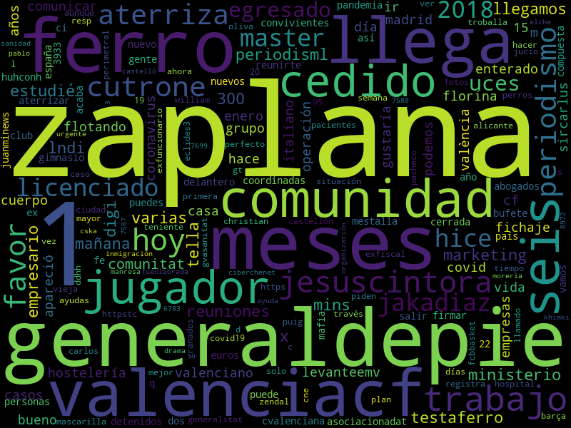

La idea es desarrollar herramientas para identificar temas relevantes a la actividad del ayuntamiento en redes sociales.

Puntos importantes:

* el objetivo final está muy poco definido aún: habrá que experimentar con las tecnologías y los datos disponibles para entender bien qué se puede hacer
* el departamento tiene estadísticos y programadores en plantilla: tienen interés en herramientas que puedan usar y extender, no en productos opacos
* hay que huir de "expertos" en márketing que abundan en este sector
* hay que evitar que las tecnologías de moda definan el proyecto: hay que definir el problema primero antes de decir eg. que vamos a usar deep learning para solucionarlo

Voy a implementar un pipeline sencillo que recoge y procesa datos de redes sociales; los prototipos son la mejor manera de forzar a concretar ideas. He lanzado la escucha hoy domingo, recogiendo 18380 tweets:

```
wc -l tweets.json_lines
   18380 tweets.json_lines
```

Y generando este tag cloud a partir de los contenidos:


* [Arquitectura](#Arquitectura)
  * [Recogida de datos](#Recogida-de-datos)
  * [Postprocesado](#Postprocesado)
  * [Resultados](#Resultados)
* [Prototipo de ejemplo](#Prototipo-de-ejemplo)
  * [Quickstart](#Quickstart)
  * [Crawler de twitter](#Crawler-de-twitter)
  * [Postprocesado de dump](#Postprocesado-de-dump)
  * [Resultados de ejemplo](#Resultados-de-ejemplo)
    * [Word cloud](#Word-cloud)
    * [Formato tabular](#Formato-tabular)
* [Desarrollo](#Desarrollo)

### Arquitectura

A grandes rasgos, los sistemas de escucha se pueden descomponer en:

1. Recogida de datos de distintas fuentes
2. Postprocesado
3. Resultados

#### Recogida de datos

Hay que definir:

* qué fuentes de datos se van a crawlear
* para cada fuente de datos, hay que escoger criterios de búsqueda
* para cada fuente de datos, hay que escoger un formato crudo para almacenar los resultados de los crawls (cuanto más crudo mejor en este punto)

#### Postprocesado

El postproceso depende totalmente del objetivo a conseguir; a diferencia del código de colección de datos, que suele cambiar bastante poco, el código de postproceso suele estar en constante evolución, sobre todo si se está haciendo análisis exploratorio.

Los datos crudos de cada fuente se transforman en formatos más convenientes (por ejemplo, en un formato tabular en csv, o en una matriz rala representada como filas de clave-valor).

Aquí se filtran los datos irrelevantes.

#### Resultados

¿Qué es lo que sale de todo este proceso?

Puede ser muchas cosas:

1. Una respuesta binaria a una pregunta eg. "La gente en Valencia aprueba la gestión del ayuntamiento este mes: Si/No"
2. Una tabla de eg. temas más comentados este mes relevantes al ayuntamiento
3. Una tabla de artículos de prensa más comentados en redes relevantes al ayuntamiento
4. Una visualización que resuma visualmente una conclusión, eg. mapa de calor que asocie colores a regiones según el interés de cada región en un tema.

Esta es la parte menos definida de vuestro proyecto.

### Prototipo de ejemplo

Es un prototipo sencillo pero toca las tres partes del sistema:

* el crawler de twitter permite especificar un criterio de búsqueda en twitter y descargar las menciones para almacenarlas
* el postprocesado limpia la representación cruda descargada y genera un fichero de tweets limpios
* los resultados:
  * dan un ejemplo de generar un word cloud a partir de los datos descargados
  * dan un ejemplo de generar un csv fácil de tratar para analistas

#### Quickstart

Esto debería funcionar en Linux o en OS X con python 3.6 o superior. Windows es otra historia.

1. Crear un virtualenv llamado env: `python3 -m venv env`
2. Instalar dependencias en el virtualenv: `env/bin/pip install -r requirements.txt`
3. Tener [credenciales de acceso a una app de twitter para poder acceder a la api](https://developer.twitter.com/en/docs/apps/overview), es gratis pero hay que pedirle a twitter que os habilite un developer account.

#### Crawler de twitter

La utilidad `tweets_to_directory` coge parámetros de variables de entorno que configuran credenciales de acceso a twitter, directorio destino y query de tweets relevantes, y los vuelca a un directorio.

Variables de entorno necesarias:

* `TARGET_DIRECTORY`: ruta al directorio destino del dump
* `CONSUMER_KEY`: credencial de api de twitter
* `CONSUMER_SECRET`: credencial de api de twitter
* `ACCESS_TOKEN_KEY`: credencial de api de twitter
* `ACCESS_TOKEN_SECRET`: credencial de api de twitter
* `TRACK_QUERY`: especificación de la búsqueda, ver [documentación de twitter](https://developer.twitter.com/en/docs/twitter-api/v1/tweets/filter-realtime/overview) para cómo se puede acotar la búsqueda

```bash
TARGET_DIRECTORY="test_dir" \
CONSUMER_KEY="**************" \
CONSUMER_SECRET="**************" \
ACCESS_TOKEN_KEY="**************" \
ACCESS_TOKEN_SECRET="**************" \
TRACK_QUERY='{"track":"vlc,valencia,valenciano,valenciana", "language":"ca,es"}' \
env/bin/python -m ayuntamiento.tweets_to_directory
```

#### Postprocesado de dump

La utilidad `extract_tweets` lee un directorio de dump generado por la utilidad `tweets_to_directory`, filtra mensajes irrelevantes y aplica borrado de tweets como exigen los términos de servicio de la api de twitter, y genera un fichero donde cada línea es un tweet en formato JSON:

```bash
env/bin/python -m ayuntamiento.extract_tweets \
  --read_dir test_dir \
  --out_file tweets.json_lines
```

#### Resultados de ejemplo

Creo que los resultados que queréis es lo que menos claro tenéis: es mejor ponerse a experimentar con los datos cuanto antes para hacerse una idea de qué cosas se pueden hacer con ellos.

Un par de ejemplos de resultados fáciles de extraer:

##### Word cloud

Un ejemplo de cómo transformar el conjunto de tweets en un [word cloud](https://en.wikipedia.org/wiki/Tag_cloud), una visualización que ayuda a hacerse una idea rápida del contenido de un montón de menciones:

```bash
env/bin/python -m ayuntamiento.tweets_to_wordcloud \
  --in_file tweets.json_lines \
  --out_file wordcloud.png
```



##### Formato tabular

Un ejemplo de un resultado a muy bajo nivel es una proyección tabular a csv, apto para analistas que no quieran lidiar con leer el formato JSON:

```bash
env/bin/python -m ayuntamiento.tweets_to_csv \
  --in_file tweets.json_lines \
  --out_file tweets.csv
```

### Desarrollo

* `make fmt` autoformatea el código
* `make check` ejecuta el typechecker y linters
* `make test` ejecuta tests unitarios
